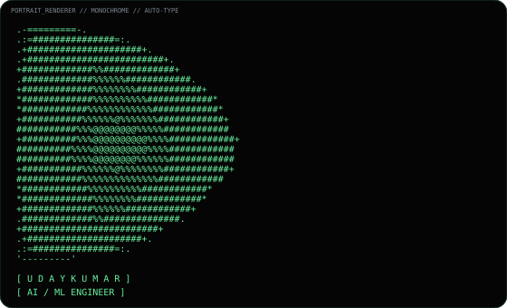
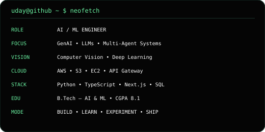

# Uday Kumar — AI/ML Engineer

<h3><code>uday@github ~ $ ./contributions.sh</code></h3>

  

<h3><code>uday@github ~ $ whoami</code></h3>

<table>
  <tr>
    <td valign="top" width="42%">
      
    </td>
    <td valign="top" width="58%">
      
    </td>
  </tr>
</table>

 

<h3><code>uday@github ~ $ ls -la</code></h3>

<a href="#projects">[ PROJECTS ]</a>
&nbsp;&nbsp;•&nbsp;&nbsp;
<a href="#stack">[ STACK ]</a>
&nbsp;&nbsp;•&nbsp;&nbsp;
<a href="#experience">[ EXPERIENCE ]</a>
&nbsp;&nbsp;•&nbsp;&nbsp;
<a href="#contact">[ CONTACT ]</a>

  

---

## `$ cat profile.txt`

<pre>
NAME       :: Uday Kumar G
ROLE       :: AI / ML Engineer
FOCUS      :: Generative AI • LLMs • Multi-Agent Systems • Computer Vision
EDUCATION  :: B.Tech — Artificial Intelligence & Machine Learning
LOCATION   :: Bengaluru, India
STATUS     :: OPEN TO AI/ML • GENAI • SOFTWARE • INTERNSHIP OPPORTUNITIES

MISSION
> Build useful intelligent systems and turn ideas into working products.
</pre>

---

## `$ tree ./projects`

### `01 / HireMind`

<pre>
RESUME
  │
  ├──► EVIDENCE CORRELATION
  ├──► HIDDEN SKILL DISCOVERY
  ├──► ROLE MATCHING
  ├──► AUTHENTICITY ANALYSIS
  └──► TECHNICAL DEPTH
              │
              ▼
      CANDIDATE INTELLIGENCE
</pre>

**AI-powered recruiter intelligence platform** built with specialized agents for candidate analysis, skill discovery and job matching.

**Stack:** Next.js • TypeScript • PostgreSQL • Supabase • GROQ

**[ ▶ LAUNCH HIREMIND ](https://github.com/udaykumar5683/HireMind)**

---

### `02 / Image Restoration & Enhancement`

<pre>
RAW IMAGE
   │
   ▼
PREPROCESS
   │
   ├──► DENOISING
   ├──► DEBLURRING
   ├──► LOW-LIGHT ENHANCEMENT
   ├──► OVEREXPOSURE CORRECTION
   ├──► COLOR CORRECTION
   ├──► SUPER RESOLUTION
   └──► FACE RESTORATION
           │
           ▼
      ENHANCED IMAGE
</pre>

Deep-learning image restoration pipeline for degraded, low-light and overexposed images using TensorFlow, OpenCV and CNN-based techniques.

**Stack:** Python • TensorFlow • OpenCV • Deep Learning

**[ ▶ VIEW SOURCE ](https://github.com/udaykumar5683/image-restoration-and-enhancement-system)**

---

### `03 / AI Career Intelligence`

<pre>
RESUME
  │
  ▼
AI AGENT NETWORK
  ├──► JOB ROLE MATCHING
  ├──► MARKET RESEARCH
  ├──► SKILL GAP DETECTION
  ├──► PLACEMENT RISK
  ├──► SALARY ESTIMATION
  └──► CAREER ROADMAP
             │
             ▼
        CAREER COPILOT
</pre>

A multi-agent career co-pilot that turns resume data into job insights, skill-gap analysis and personalized growth strategies.

**[ ▶ OPEN MY PROJECTS ](https://github.com/udaykumar5683?tab=repositories)**

---

## `$ cat /stack`

<pre>
GENERATIVE AI
├── LLM Applications
├── Prompt Engineering
├── Multi-Agent Systems
├── LangChain
├── CrewAI
├── Hugging Face
└── GROQ

MACHINE LEARNING
├── Python
├── TensorFlow
├── PyTorch
├── OpenCV
├── NLP
└── Computer Vision

SOFTWARE + CLOUD
├── TypeScript
├── Next.js
├── React
├── SQL
├── Java
├── C
├── AWS
├── S3
├── EC2
├── API Gateway
└── Git / GitHub
</pre>

**[ ▶ EXPLORE ALL REPOSITORIES ](https://github.com/udaykumar5683?tab=repositories)**

---

## `$ tail -n 20 /experience.log`

<pre>
2026.02 — 2026.05
CLOUD COMPUTING INTERN
SmartBridge Educational Services Pvt. Ltd.
AWS • Cloud workflows • Storage • Deployment

2024.04 — 2024.05
PYTHON DEVELOPER INTERN
EZTS IT/Computers – Software
Python • Automation • OOP • Logic modules
</pre>

---

## `$ cat /certifications`

<pre>
[✓] AWS Cloud Practitioner
[✓] IBM — Getting Started with Enterprise AI
[✓] Google Cloud — Career Launchpad
[✓] Deloitte — Data Analytics Job Simulation
[✓] British Airways — Data Science Job Simulation
</pre>

---

## `$ cat /telemetry`

  

> The animated contribution calendar above is generated locally in this repository from GitHub's public contribution calendar. No third-party stats service is used for the heatmap.

---

## `$ connect --open`

<pre>
┌───────────────────────────────────────────────────────────┐
│                    COMMUNICATION HUB                     │
├───────────────────────────────────────────────────────────┤
│ LinkedIn :: linkedin.com/in/udaykumargudagudi            │
│ GitHub   :: github.com/udaykumar5683                     │
│ Email    :: udaykumargudagudi961@gmail.com               │
└───────────────────────────────────────────────────────────┘
</pre>

  

<a href="#uday-kumar--aiml-engineer">[ ↑ BACK TO TOP ]</a>

---

<code>uday@github:~$ exit</code>

